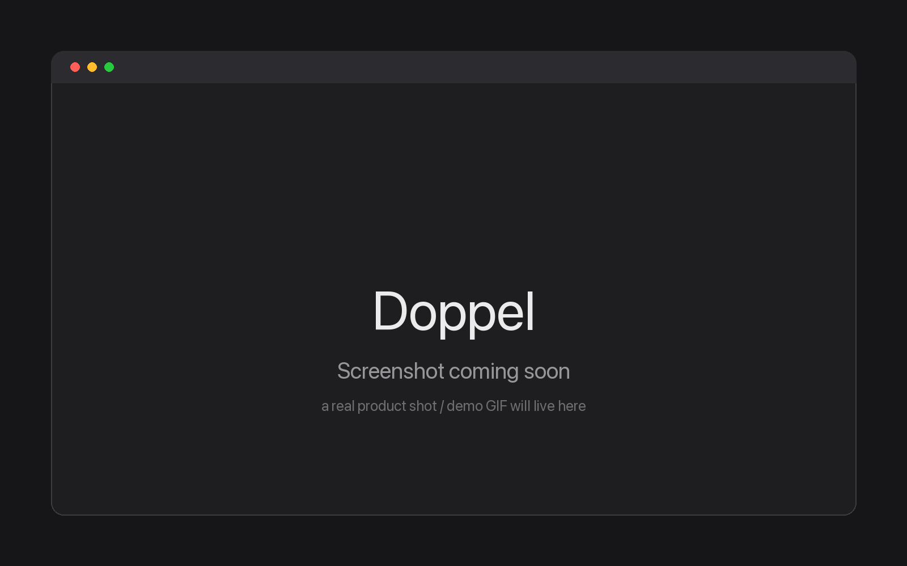
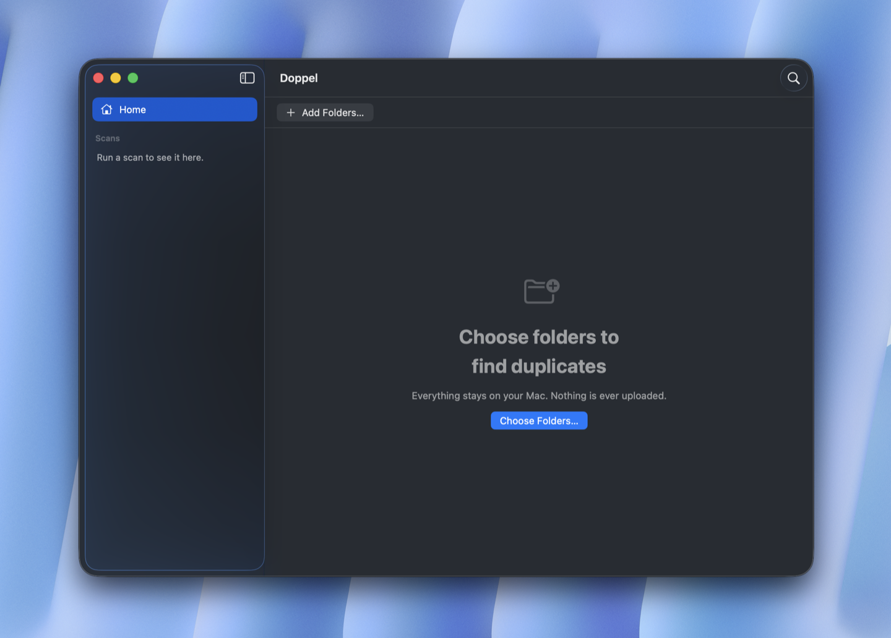
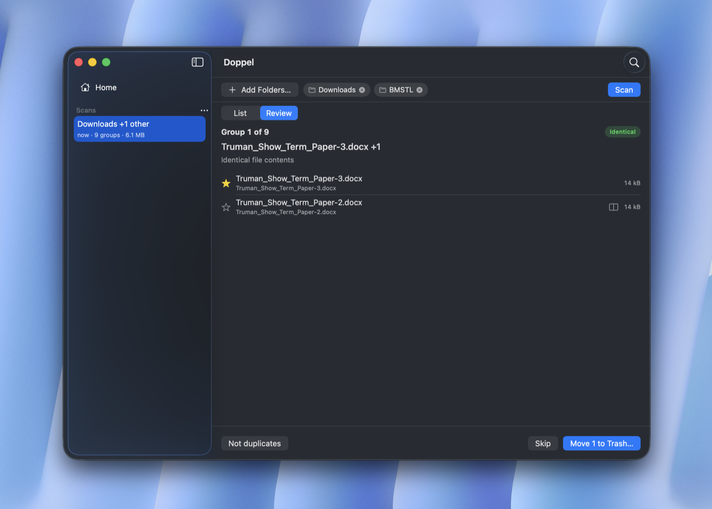
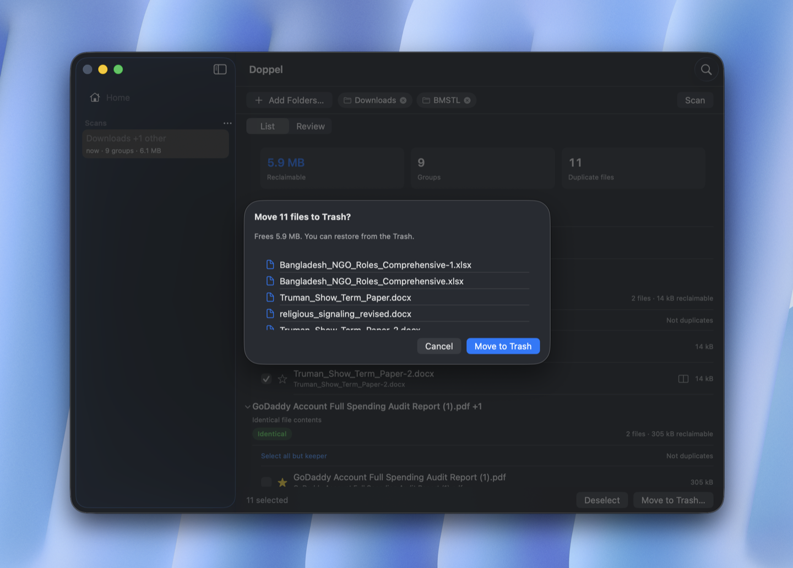

<p align="center">
  <picture>
    <source media="(prefers-color-scheme: dark)" srcset="doppel_dark_logo.png">
    <source media="(prefers-color-scheme: light)" srcset="doppel_light_logo.png">
    
  </picture>
</p>

<h1 align="center">Doppel</h1>

<p align="center">
  <b>Find duplicate & near-duplicate files by what's <i>inside</i> them — not just name and size.</b><br>
  100% offline. Runs on your Mac. Nothing ever leaves.
</p>

<p align="center">
  <a href="https://github.com/ishm6m/doppel/releases/latest"></a>
  <a href="LICENSE"></a>
  
  
</p>

<p align="center">
  
</p>

## Why I built this

Every "find duplicate files" app I tried matches on filename and byte-for-byte hashes. Useless the moment you've got `contract.pdf` and `contract-final-v2.pdf` — same document, different bytes, and every tool on the App Store shrugs.

Doppel actually *reads* your files. It'll tell you **"these two are the same contract with different dates"** and let you trash the one you don't want. All on-device, using the Neural Engine. No account, no cloud, no telemetry — I mean it, the app opens **zero** network connections.

## How it works

It runs a cascade, cheapest checks first, so it only does the expensive ML on files that actually need it:

```
your files ─▶ size/metadata     group by the obvious stuff
           ─▶ SHA-256           exact dupes (free)
           ─▶ pHash / MinHash   near-dupe candidates (cheap)
           ─▶ embeddings        semantic matches, on-device (only on survivors)
           ─▶ you review & trash — every match tells you why + how sure it is
```

Nothing is ever deleted — files go to the Trash, always undoable. Deep dive: [`ARCHITECTURE.md`](ARCHITECTURE.md).

## Screens

<table>
  <tr>
    <td width="33%"><br><sub><b>Point it at your folders.</b> Everything stays on your Mac — nothing is ever uploaded.</sub></td>
    <td width="33%"><br><sub><b>Review, one group at a time.</b> Two versions of the same paper, flagged identical — keep the star, trash the rest.</sub></td>
    <td width="33%"><br><sub><b>Nothing goes without a yes.</b> See exactly what moves to the Trash — restore any of it later.</sub></td>
  </tr>
</table>

Documents today (text · PDF · <code>.docx</code> · <code>.xlsx</code>) — images are next. Every group tells you **why** it matched and how much space you'd reclaim.

## Install

```bash
brew install --cask --no-quarantine ishm6m/doppel/doppel
```

Or grab `Doppel.zip` from the [latest release](https://github.com/ishm6m/doppel/releases/latest), unzip, drag to `/Applications`, then **right-click ▸ Open** once.

> Heads up: I don't have a paid Apple Developer account, so the build is ad-hoc signed, not notarized. Gatekeeper will ask you to approve it once — normal for open-source Mac apps, doesn't touch the privacy guarantees. Updates come through `brew upgrade`; there's no in-app updater, which is *why* the app can stay fully offline.

## Build from source

```bash
git clone https://github.com/ishm6m/doppel.git && cd doppel
brew install xcodegen && xcodegen generate
xcodebuild -scheme Doppel -configuration Debug build
```

Tests & linters: `swiftformat . && swiftlint --strict && xcodebuild test -scheme Doppel -destination 'platform=macOS'`

## Status

Early. MVP does **documents (text + PDF)** first; images are next. It's real and it runs — expect rough edges. Issues and PRs welcome.

## Under the hood

Swift 6 · SwiftUI · GRDB/SQLite · Core ML. The detection engine is a pure-Swift package with no UI dependency — poke around in `Packages/DetectionEngine/`.

## License

[MIT](LICENSE) — do whatever you want with it.
